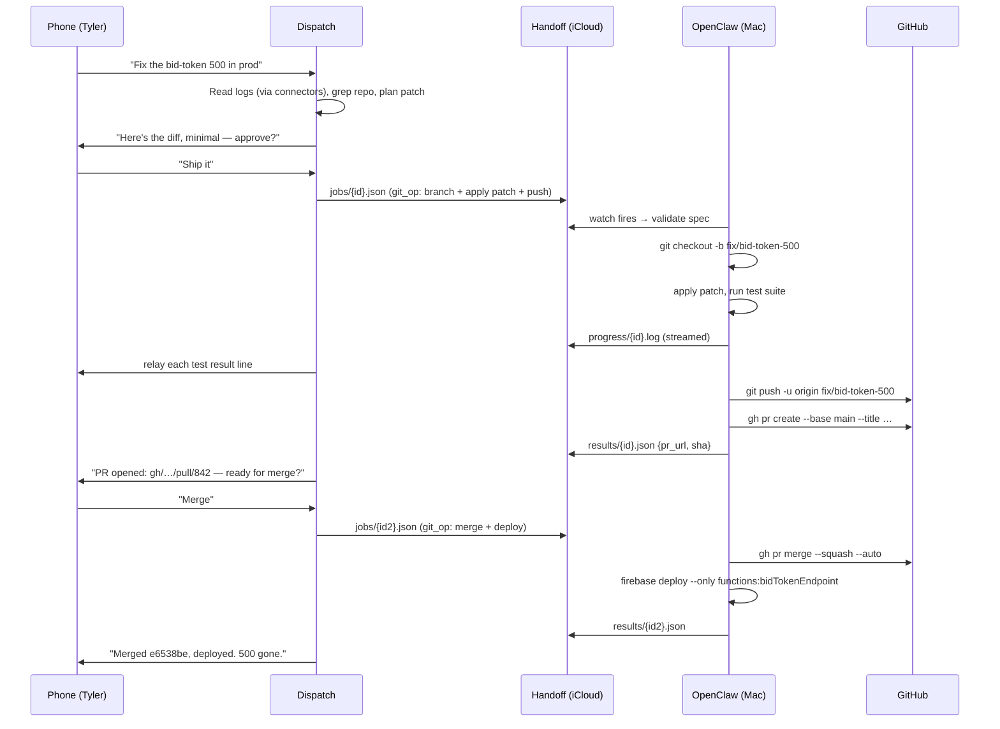

# Dispatch × OpenClaw — Hybrid Pattern

**Status:** design / v0
**Owner:** Tyler
**Last touched:** 2026-07-12

Phone-driven planning brain (Cowork Dispatch, cloud sandbox) plus Mac-native
execution hand (OpenClaw on the Mac Mini M4). A drop-folder in iCloud is the
seam. Dispatch drops job specs, OpenClaw watches, executes as Tyler's user,
writes results back.

---

## 1. Purpose & motivation

Neither surface alone covers the ground. Dispatch is reachable from anywhere —
airport, meeting, couch, phone lock screen — but runs in a sandbox with no
launchd, no Keychain, no `gh`/`gcloud` as Tyler, no persistence after the tab
closes. OpenClaw runs on the Mac Mini as Tyler's user with full native powers
(launchd agents, iCloud, Xcode, credentialed CLIs, background daemons that
survive session close) but has no phone-facing UI and no independent
initiative — it needs a trigger. Wire them together with a job queue in iCloud
and each side does what it's built for: Dispatch thinks and dispatches;
OpenClaw executes and persists.

---

## 2. Architecture

```
                    Tyler's phone (Cowork app)
                              │
                              ▼
        ┌────────────────────────────────────────┐
        │       Cowork Dispatch  (cloud sbx)     │
        │  planning · browser MCP · web fetch    │
        │  memory · code review · chat replies   │
        └─────────────┬────────────────▲─────────┘
                      │ writes JSON    │ tails results.jsonl
                      ▼                │ + progress.log
        ~/Library/Mobile Documents/com~apple~CloudDocs/
                skyeline-handoff/
                ├── jobs/{id}.json      (Dispatch → OpenClaw)
                ├── results/{id}.json   (OpenClaw → Dispatch)
                ├── progress/{id}.log   (OpenClaw → Dispatch, streamed)
                └── inbox.lock          (single-writer flag)
                      │                ▲
                      │ launchd        │ writes
                      │ WatchPaths     │
                      ▼                │
        ┌────────────────────────────────────────┐
        │        OpenClaw  (Mac Mini M4)         │
        │  claude cli · launchd · gh · gcloud    │
        │  Firebase · Xcode · ~/dev writes       │
        │  background daemons post-session       │
        └────────────────────────────────────────┘
```

Flow, one direction at a time:

- **Dispatch → OpenClaw:** write `jobs/{id}.json` — spec + payload + constraints.
- **OpenClaw → Dispatch:** append `progress/{id}.log` line-by-line while
  running; write `results/{id}.json` on completion. Dispatch polls both.

iCloud syncs in seconds when the file is small (<64 KB job specs, chunked logs
capped at 256 KB per segment). No custom transport, no tunnels, no auth
gymnastics — Apple carries the bytes.

---

## 3. Handoff mechanisms

### Recommended: iCloud drop-folder + launchd `WatchPaths`

`~/Library/Mobile Documents/com~apple~CloudDocs/skyeline-handoff/` shared by
Dispatch (via a mounted Cowork folder — either the existing Skyelineos mount
or a dedicated `skyeline-handoff` mount) and OpenClaw (native filesystem).

- Dispatch writes `jobs/{uuid}.json` atomically (`.tmp` → rename).
- A launchd LaunchAgent (`com.skyeline.openclaw.handoff.plist`) watches
  `jobs/` with `WatchPaths` and fires a shell shim on any change.
- The shim invokes `openclaw run-job <path>`, which validates the spec against
  the allow-list, executes, streams progress to `progress/{id}.log`, and writes
  a final `results/{id}.json`.
- Dispatch tails `progress/{id}.log` (short polling loop, 1–2 s) and shows
  updates in chat.

Why this wins: zero infra, zero auth, zero tunneling, survives Mac reboots
(launchd), survives Cowork session close (results persist in iCloud), works
offline on the Mac side (jobs queue until iCloud syncs), Tyler can inspect
the queue from Finder if anything looks stuck.

### Alt 1: local HTTP webhook + Cloudflare tunnel

OpenClaw runs a FastAPI process on `127.0.0.1:8787`; a Cloudflare Tunnel
exposes it as `openclaw.skyeline.internal`. Dispatch POSTs jobs, receives job
id, opens an SSE stream for progress. Faster round-trip (~200 ms), but adds:
tunnel daemon, HMAC signing, retry logic on tunnel drops, one more thing to
notice when it's broken.

### Alt 2: GitHub Actions bridge

Dispatch commits `handoff/{id}.json` to a `handoff` branch; a `workflow_run`
on OpenClaw's self-hosted runner picks it up. Auditable and diffable, but
30–90 s of cold-start latency and a lot of ceremony for a two-line command.
Save for future async batch jobs (nightly deploy trains).

**Decision:** ship iCloud drop-folder in Phase 1. Revisit HTTP if latency
becomes the bottleneck.

---

## 4. Job spec schema

```json
{
  "id": "01JZ8W...ULID",
  "created_at": "2026-07-12T14:03:22Z",
  "job_type": "native_deploy",
  "priority": "normal",
  "timeout_s": 900,
  "payload": {
    "prompt": "Deploy acquisition-engine to Firebase prod...",
    "cwd": "~/dev/acquisition-engine",
    "env": { "FIREBASE_PROJECT": "skyelineos-prod" }
  },
  "constraints": {
    "allow_paths": ["~/dev/acquisition-engine", "~/logs/openclaw"],
    "allow_commands": ["gh", "git", "firebase", "npm", "node", "gcloud"],
    "require_confirmation": true,
    "confirmation_channel": "phone_push"
  },
  "callback": {
    "results_path": "results/01JZ8W...ULID.json",
    "progress_path": "progress/01JZ8W...ULID.log",
    "notify": "push:tyler"
  }
}
```

### Fields

- `id` — ULID (lexicographic, timestamp-prefixed, avoids clock races).
- `created_at` — ISO-8601 UTC. OpenClaw rejects specs older than `timeout_s`.
- `job_type` — enum: `mac_command`, `git_op`, `launchd_install`,
  `native_deploy`, `file_op`. Handler per type in `openclaw/handlers/`.
- `priority` — `low` | `normal` | `high`. High jumps the queue; low is
  deferred until human idle (no active `caffeinate` process).
- `timeout_s` — hard kill after this many seconds. Default 300.
- `payload` — job-type-specific. Free-form JSON.
- `constraints.allow_paths` — every write and every `cwd` must be under one
  of these. Enforced pre-execution; hard fail otherwise.
- `constraints.allow_commands` — every shell binary invoked must be in this
  list. Enforced by wrapping execution in a restricted `PATH`.
- `constraints.require_confirmation` — if `true`, OpenClaw sends a push to
  Tyler's phone, waits for tap (via a shared `confirmations/{id}.json` file),
  and only then proceeds. Timeout → job fails closed.
- `callback` — where to write results/progress; how to notify.

### Job types (v0)

| `job_type`        | Purpose                                            | Example                   |
| ----------------- | -------------------------------------------------- | ------------------------- |
| `mac_command`     | Single shell one-liner.                            | `brew upgrade nimble-cli` |
| `git_op`          | Branch/commit/push in a whitelisted repo.          | Rebase a PR branch.       |
| `launchd_install` | Install/reload a LaunchAgent from a plist payload. | Add a nightly sync job.   |
| `native_deploy`   | Long-running deploy prompt handed to `claude` CLI. | Firebase deploy loop.     |
| `file_op`         | Read / write / move under allow-listed paths.      | Update a config file.     |

Every result envelope is uniform:

```json
{
  "id": "01JZ8W...",
  "status": "ok" | "failed" | "timeout" | "denied",
  "started_at": "...",
  "finished_at": "...",
  "exit_code": 0,
  "stdout_tail": "...last 4 KB...",
  "stderr_tail": "...last 4 KB...",
  "artifacts": [
    { "path": "~/logs/openclaw/01JZ8W.../deploy.log", "size": 128492 }
  ],
  "notes": "human-readable one-liner Dispatch can relay verbatim"
}
```

---

## 5. Constraints & safety

Dispatch runs in a sandbox that can't see Tyler's Mac. That's a feature: the
sandbox can't accidentally rm anything. OpenClaw is the trust boundary. Every
job spec is validated _before_ execution.

### Hard rules (enforced in `openclaw/policy.py`)

- **Path allow-list.** Any write outside `~/dev`, `~/logs`, or an explicitly
  whitelisted LaunchAgent plist path is denied. Reads are broader but still
  bounded (no `~/Library/Keychains`, no `~/.ssh` unless the job type is
  `git_op` and the repo is on the repo allow-list).
- **Command allow-list.** `PATH` is rewritten to a curated `~/bin/openclaw/`
  containing symlinks to only the binaries this job type permits. `sudo`,
  `mail`, `sendmail`, `osascript` (interactive), `security` — never allowed.
- **No unsolicited outbound comms.** OpenClaw doesn't send email or SMS.
  The only outbound channel is the pre-approved digest push (Pushover /
  APNs) tied to the confirmation flow.
- **Prod deploy gate.** Any `native_deploy` targeting a Skyelineos prod
  Firebase project or a `gcloud` project matching `skyelineos-prod*`
  requires an interactive tap on Tyler's phone. No exceptions, no override
  field in the spec. Written as an explicit `deny_unless_confirmed` clause
  in `policy.py`, not a mutable flag.
- **Repo allow-list.** `git_op` and `native_deploy` only touch repos under
  `~/Projects/` or `~/dev/` that appear in `openclaw/repos.allow`.
- **Kill switch.** Touching `~/Library/Mobile Documents/com~apple~CloudDocs/skyeline-handoff/HALT`
  causes OpenClaw to reject all new jobs until the file is removed. Trivial
  to invoke from Files.app on the phone.

### Failure modes worth naming

- iCloud sync hang → jobs stack in `jobs/`, OpenClaw drains once sync
  resumes. Dispatch shows "queued (iCloud)" if a job spec doesn't produce a
  `progress/` line within 30 s.
- Two Dispatch sessions writing at once → `id` collisions avoided by ULID;
  `inbox.lock` is advisory only, single-writer flag for policy edits, not
  for job writes.
- Progress log truncation → OpenClaw rotates `progress/{id}.log` at 256 KB
  into `.1`, `.2`, etc. Dispatch follows the highest suffix.

---

## 6. Concrete example — acquisition-engine deploy

The exact scenario Tyler hit last week: he asked Cowork to deploy
`acquisition-engine` to Firebase. Cowork planned it fine but couldn't
authenticate `firebase-tools` or persist beyond the session. Here's how the
hybrid handles it.

**On the phone, in Cowork:**
Tyler: "Deploy acquisition-engine to prod."

**Dispatch:**

1. Reads memory: knows the repo lives at `~/dev/acquisition-engine`, prod
   project is `skyelineos-prod`, deploy is a long-running `claude` CLI loop.
2. Writes job spec:

```json
{
  "id": "01JZ8W1A...",
  "job_type": "native_deploy",
  "timeout_s": 1800,
  "payload": {
    "prompt": "Run the acquisition-engine deploy prompt from ~/dev/acquisition-engine/deploy.md against skyelineos-prod. Run the test suite first; abort on any red. Report each firebase deploy line.",
    "cwd": "~/dev/acquisition-engine"
  },
  "constraints": {
    "allow_paths": ["~/dev/acquisition-engine", "~/logs/openclaw"],
    "allow_commands": [
      "claude",
      "gh",
      "git",
      "firebase",
      "npm",
      "node",
      "gcloud"
    ],
    "require_confirmation": true
  },
  "callback": {
    "results_path": "results/01JZ8W1A....json",
    "progress_path": "progress/01JZ8W1A....log",
    "notify": "push:tyler"
  }
}
```

3. Drops it in `jobs/` via the mounted folder.
4. Enters a tail loop on `progress/01JZ8W1A....log`, showing Tyler each line
   as it lands. Explains what he's seeing on the phone.

**OpenClaw:**

1. launchd fires the watcher within ~500 ms.
2. Policy check passes; prod deploy triggers a confirmation push.
3. Tyler taps "confirm" on his phone → `confirmations/01JZ8W1A....json`
   written by the notify app; OpenClaw sees it and starts.
4. Spawns `claude --prompt-file deploy.md --allow-cli claude,gh,git,firebase,npm,node,gcloud`
   inside `~/dev/acquisition-engine`, tees stdout to `progress/…log`.
5. On success: writes `results/…json` with `status: "ok"`, deploy URL in
   `notes`. Fires a follow-up push.
6. On failure: writes `status: "failed"`, last 4 KB of stderr in tail,
   `notes` = one-liner ("Firestore rules deploy 403 — check IAM").

**Dispatch (still on Tyler's phone):**
Sees the terminal state in `results/…json`, tells Tyler "prod deploy landed
at https://…, run took 4m12s." Done. Tyler never opened a Mac window.

---

## 7. Concrete example — SkyelineOS bug fix loop

Repo work with a review checkpoint. Sequence:



Two round-trips through the handoff, both under a minute of iCloud latency,
Tyler never left the phone. Everything credentialed (gh, firebase) ran as
his user on the Mac.

---

## 8. What stays purely in Dispatch

Anything cloud-native, credential-free, or better served by Dispatch's
existing MCPs:

- Web scraping & research (Nimble, WebFetch, WebSearch).
- API calls that use tokens Dispatch already has (Slack, Gmail, Calendar,
  QuickBooks, GitHub read via public endpoints).
- Browser control via Claude-in-Chrome (login flows, dashboards).
- Code review, PR diff analysis, doc drafting.
- Memory management (CLAUDE.md, memory/) and shorthand decoding.
- Anything Tyler wants a second opinion on before it becomes a job spec.

Rule of thumb: if a task doesn't need Tyler's Mac Keychain, launchd, or
outlives the current Cowork session, it stays in Dispatch.

---

## 9. What stays purely in OpenClaw

Anything that requires:

- Native macOS APIs (Notification Center, Keychain, TCC-gated folders).
- `launchd` — installing, loading, unloading LaunchAgents / LaunchDaemons.
- Credentialed CLIs as Tyler's user: `gh`, `gcloud`, `firebase`,
  `xcodebuild`, `notarytool`.
- iCloud filesystem access (`~/Library/Mobile Documents/…`) and
  Mobile-Documents-backed workflows.
- Background persistence after Cowork closes — long deploys, watchers,
  scheduled sync jobs.
- Xcode, simulators, `xcrun`, `codesign`.
- Anything that writes under `~/dev` or the local Projects tree.

Rule of thumb: if the phone can't do it, OpenClaw does it. If the sandbox
would need a credential Tyler owns, OpenClaw does it.

---

## 10. Rollout plan

### Phase 1 — this week (v0, walking skeleton)

- Create `~/Library/Mobile Documents/com~apple~CloudDocs/skyeline-handoff/`
  with `jobs/`, `results/`, `progress/`, `confirmations/` subdirs.
- `~/bin/openclaw/run-job` shell shim (~50 lines of bash): validate JSON,
  check allow-list, exec, capture stdout to progress log.
- `com.skyeline.openclaw.handoff.plist` LaunchAgent, `WatchPaths` on
  `jobs/`, loaded via `launchctl bootstrap gui/501`.
- One job type: `mac_command`. Allow-list hardcoded (`ls`, `git status`,
  `gh pr list`, `brew outdated` — read-only stuff).
- Mount `skyeline-handoff/` in Cowork. Dispatch writes specs by hand for now.
- Success test: from phone, `"ls ~/dev"` → see result in <10 s.

### Phase 2 — next week

- Add `git_op` and `native_deploy` handlers.
- Real allow-list files: `openclaw/paths.allow`, `openclaw/commands.allow`,
  `openclaw/repos.allow`.
- Confirmation flow: Pushover integration + `confirmations/` polling.
- Prod-deploy gate wired up (deny-unless-confirmed on `skyelineos-prod*`).
- Kill switch (`HALT` file check).

### Phase 3 — real-time UX

- Dispatch-side helper: `dispatch-tail <job-id>` that follows the progress
  log and streams chunks into chat, showing Tyler updates line-by-line.
- Progress-log rotation and Dispatch-side reassembly.
- `launchd_install` and `file_op` handlers.
- Metrics: per-job latency histogram written to
  `~/logs/openclaw/metrics.jsonl` for later review.

### Phase 4 — nice-to-have

- Web dashboard at `openclaw.local` (Bonjour, no cloud) for queue inspection.
- Batch mode: `jobs/batch/{id}.json` with a list of sub-jobs, atomic
  succeed-or-rollback.
- Cross-Mac failover: second machine subscribes to the same iCloud folder,
  takes over if primary is offline > 5 min.

---

## Appendix — file layout

```
~/bin/openclaw/
  run-job                       # entry-point shim (bash)
  handlers/
    mac_command.sh
    git_op.sh
    launchd_install.sh
    native_deploy.sh
    file_op.sh
  policy.py                     # allow-list enforcement
  paths.allow
  commands.allow
  repos.allow

~/Library/LaunchAgents/
  com.skyeline.openclaw.handoff.plist

~/Library/Mobile Documents/com~apple~CloudDocs/skyeline-handoff/
  jobs/
  results/
  progress/
  confirmations/
  HALT                          # touch to pause

~/logs/openclaw/
  {job-id}/
    deploy.log
    stderr.log
  metrics.jsonl
```

## Appendix — LaunchAgent plist (skeleton)

```xml
<?xml version="1.0" encoding="UTF-8"?>
<!DOCTYPE plist PUBLIC "-//Apple//DTD PLIST 1.0//EN"
  "http://www.apple.com/DTDs/PropertyList-1.0.dtd">
<plist version="1.0">
<dict>
  <key>Label</key>
  <string>com.skyeline.openclaw.handoff</string>
  <key>ProgramArguments</key>
  <array>
    <string>/Users/tylerrhoton/bin/openclaw/run-job</string>
    <string>--drain</string>
  </array>
  <key>WatchPaths</key>
  <array>
    <string>/Users/tylerrhoton/Library/Mobile Documents/com~apple~CloudDocs/skyeline-handoff/jobs</string>
  </array>
  <key>ThrottleInterval</key>
  <integer>1</integer>
  <key>StandardOutPath</key>
  <string>/Users/tylerrhoton/logs/openclaw/launchd.out.log</string>
  <key>StandardErrorPath</key>
  <string>/Users/tylerrhoton/logs/openclaw/launchd.err.log</string>
</dict>
</plist>
```

## Open questions

- Confirmation-push channel: Pushover vs. APNs via a tiny custom app?
  Pushover is instant to ship; APNs is nicer long-term.
- Do we want Dispatch to be able to _cancel_ an in-flight job? Simplest:
  drop `jobs/{id}.cancel`, OpenClaw honors on next SIGTERM check.
- iCloud latency on cellular — worst case observed so far ~15 s. Fine for
  deploys, borderline for chat-feel. Revisit if it hurts.
- Where do secrets that Dispatch needs to _know about_ (not use) live?
  Probably nowhere — Dispatch stays credential-blind, OpenClaw is the only
  side that touches Keychain.
